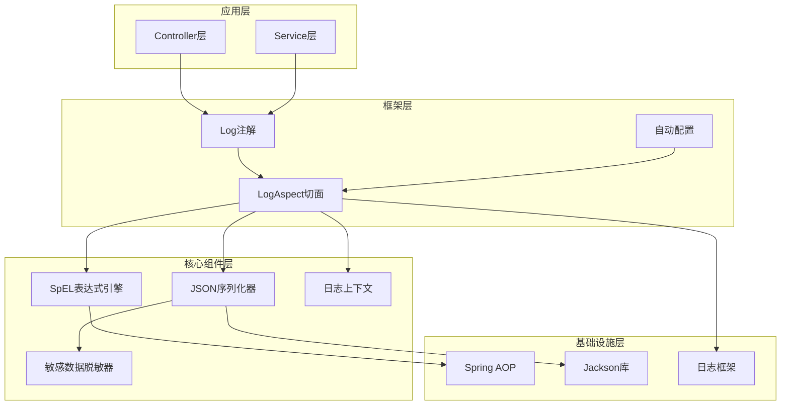
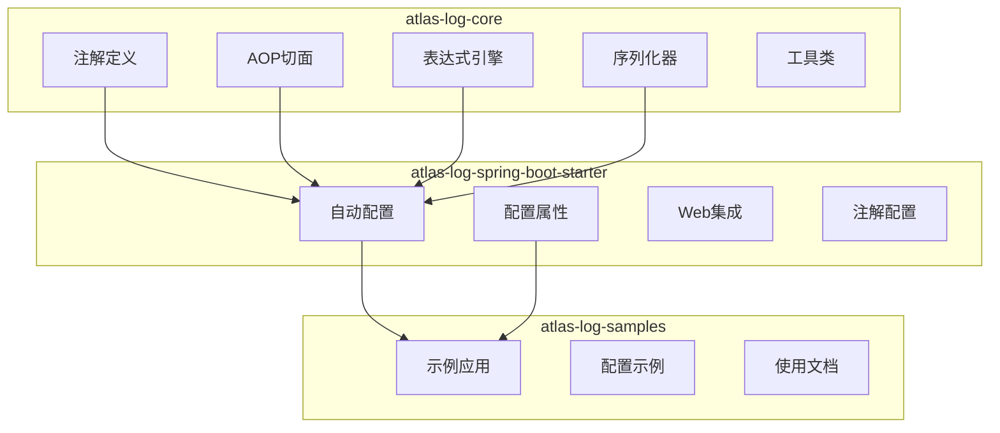
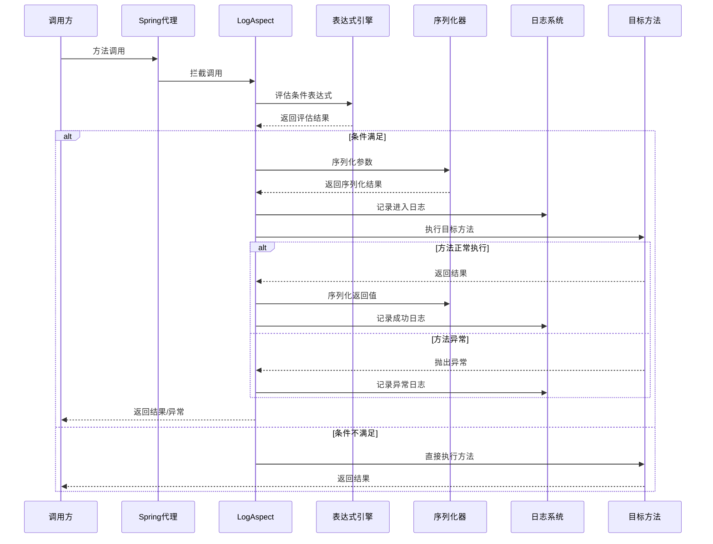
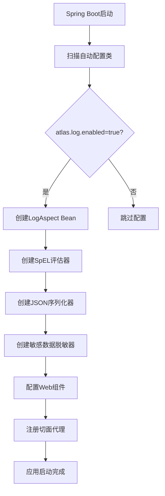
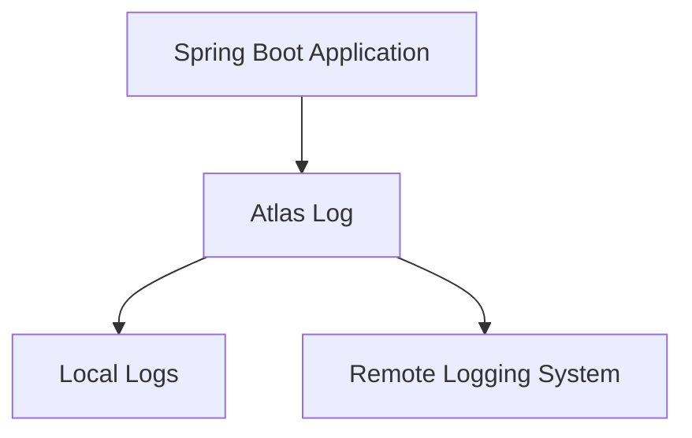
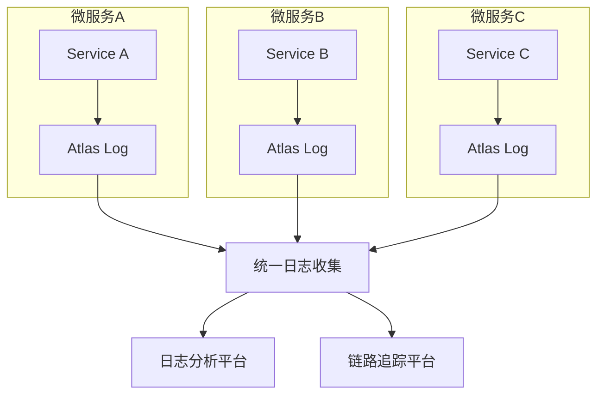

# Atlas Log 系统架构

## 整体架构设计

Atlas Log 采用分层架构设计，基于 Spring Boot Starter 模式实现自动配置和组件装配。架构设计遵循高内聚、低耦合的原则，确保组件间职责清晰，易于扩展和维护。

### 架构分层



## 模块设计

### 模块职责划分

Atlas Log 项目采用多模块设计，各模块职责明确：



### 模块详细说明

#### atlas-log-core
核心功能模块，包含框架的基础功能：

- **annotation/** - 日志注解定义
  - `@Log` - 主要日志注解
  - `@Logs` - 多注解支持
  - `@LogIgnore` - 参数忽略注解
  - `LogLevel` - 日志级别枚举

- **aspect/** - AOP切面实现
  - `LogAspect` - 核心切面逻辑

- **expression/** - 表达式引擎
  - `SpelExpressionEvaluator` - SpEL表达式评估器

- **serializer/** - 序列化组件
  - `JsonArgumentSerializer` - JSON序列化器
  - `SensitiveDataMasker` - 敏感数据脱敏器

- **context/** - 上下文管理
  - `LogContext` - 日志上下文
  - `TraceIdHolder` - TraceId管理

#### atlas-log-spring-boot-starter
Spring Boot集成模块：

- **config/** - 配置相关
  - `LogAutoConfiguration` - 自动配置类
  - `LogConfigProperties` - 配置属性绑定
  - 注解配置处理器和验证器

- **web/** - Web集成组件
  - `LoggingFilter` - 请求日志过滤器
  - `TraceIdInterceptor` - TraceId拦截器

#### atlas-log-samples
示例和文档模块：

- 完整的使用示例
- 配置示例和文档
- 最佳实践展示

## 核心工作流程

### 日志记录执行流程



### 自动配置流程



## 核心组件详解

### LogAspect - 核心切面

LogAspect 是框架的核心组件，负责拦截被 `@Log` 注解标记的方法：

**主要职责：**
- 方法拦截和代理
- 条件表达式评估
- 参数和返回值序列化
- 执行时间统计
- 异常处理和日志记录

**关键方法：**
- `logExecutionAround()` - 环绕通知主方法
- `processLogAnnotation()` - 注解处理逻辑
- `handleException()` - 异常处理逻辑

### SpelExpressionEvaluator - 表达式引擎

基于 Spring Expression Language 实现的动态表达式评估器：

**支持的上下文变量：**
- `args` - 方法参数数组
- `result` - 方法返回值
- `exception` - 异常对象
- `methodName` - 方法名
- `className` - 类名
- `executionTime` - 执行时间

**表达式缓存：**
- 使用 `ConcurrentHashMap` 缓存编译后的表达式
- 避免重复解析提升性能

### JsonArgumentSerializer - 序列化器

负责将方法参数和返回值序列化为JSON格式：

**核心功能：**
- 对象JSON序列化
- 长度限制和截断
- 敏感数据脱敏集成
- 循环引用处理

### SensitiveDataMasker - 脱敏器

自动识别和脱敏敏感数据：

**内置敏感字段：**
- password, pwd, secret, token
- phone, mobile, email
- bankCard, creditCard, idCard

**脱敏策略：**
- 短字符串：全部用 * 替换
- 长字符串：保留前后若干字符，中间用 * 替换
- 支持自定义脱敏字段和策略

## 性能考量

### 性能优化策略

1. **表达式缓存**
   - SpEL表达式编译后缓存，避免重复解析
   - 使用线程安全的 ConcurrentHashMap

2. **序列化优化**
   - 参数长度限制，避免大对象序列化
   - 延迟序列化，只在需要时进行

3. **条件过滤**
   - 支持条件表达式，减少不必要的日志记录
   - 标签过滤，只记录关注的日志

4. **异步处理**
   - 建议配置异步日志 Appender
   - 避免日志I/O阻塞业务线程

### 性能监控

框架内置性能监控功能：
- 方法执行时间统计
- 慢方法识别和告警
- 日志记录开销统计

## 扩展点设计

### 自定义序列化器

```java
@Component
public class CustomArgumentSerializer implements ArgumentSerializer {
    @Override
    public String serialize(Object obj, int maxLength) {
        // 自定义序列化逻辑
    }
}
```

### 自定义脱敏器

```java
@Component
public class CustomSensitiveDataMasker extends SensitiveDataMasker {
    @Override
    protected boolean isSensitiveField(String fieldName) {
        // 自定义敏感字段判断
    }
}
```

### 自定义TraceId生成器

```java
@Component
public class CustomTraceIdGenerator implements TraceIdGenerator {
    @Override
    public String generate() {
        // 自定义TraceId生成逻辑
    }
}
```

## 安全考虑

### 敏感数据保护

1. **自动脱敏**
   - 内置常见敏感字段识别
   - 支持自定义敏感字段配置

2. **参数排除**
   - `excludeArgs` 指定排除的参数索引
   - `@LogIgnore` 注解标记忽略的参数

3. **长度限制**
   - 防止敏感数据泄露
   - 控制日志存储成本

### 表达式安全

1. **SpEL安全配置**
   - 禁用危险的SpEL功能
   - 限制可访问的类和方法

2. **异常处理**
   - 表达式异常不影响业务逻辑
   - 提供 fail-safe 机制

## 部署架构

### 单体应用部署



### 微服务架构部署



## 总结

Atlas Log 的架构设计充分考虑了以下原则：

1. **简单易用** - 通过注解驱动，降低使用门槛
2. **高性能** - 多级缓存和优化策略，最小化性能影响
3. **可扩展** - 清晰的扩展点设计，支持自定义功能
4. **安全可靠** - 完善的敏感数据保护和异常处理机制
5. **生产就绪** - 丰富的配置选项和监控功能

这种架构设计使得 Atlas Log 既能满足简单场景的快速集成需求，也能应对复杂企业应用的高级需求。